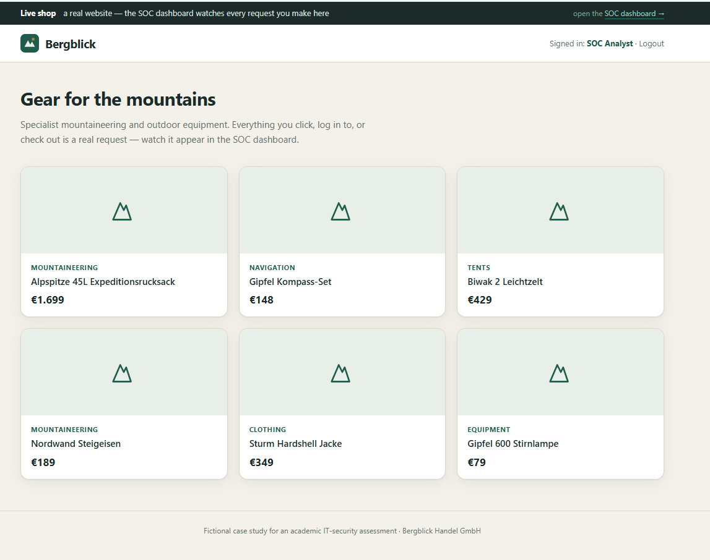
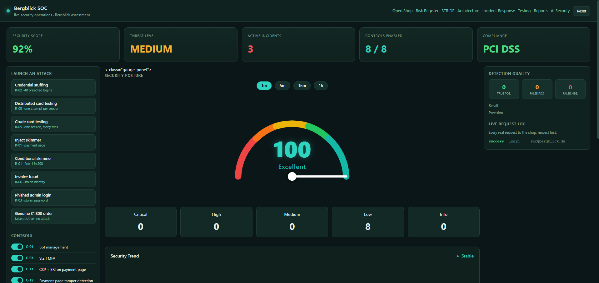

# Bergblick — Live Shop + Security Operations Dashboard

A **real running e-commerce website** with a **live Security Operations Center (SOC)
dashboard** beside it. From a control panel you launch real attacks against the shop;
each one fires genuine HTTP requests at the shop's own endpoints, the SOC detects them
from the resulting traffic, and every detection maps back to a documented risk and
security control.

Nothing is faked or animated. An alert appears because real requests with real
properties were logged and evaluated by real detection logic — the same way a monitoring
system works off a live access log. Turn a security control off and the corresponding
detector genuinely goes quiet and the attack succeeds.



---

## What it demonstrates



A full-stack security engineering project in one self-contained app:

- **A working shop** — browse products, log in, run a checkout. Every real user action
  is logged and shows up in the SOC, exactly like the attacks.
- **A live SOC dashboard** — request log, active detections, and a running tally of
  true positives, false positives, and false negatives.
- **Toggleable security controls** — bot management, tag-manager governance, tamper
  detection, staff MFA, velocity limits, aggregate monitoring, and more. The outcome of
  every attack depends on which controls are enabled.
- **Realistic attack scenarios**, each tied to a real-world threat:
  - **Credential stuffing** — breached-password login attempts from rotating IPs
  - **E-skimming / Magecart** — a payment-page card skimmer, including a *conditional*
    variant that only fires for a small fraction of sessions (a deliberate false-negative case)
  - **Card testing** — both crude (per-session) and distributed (one attempt per session,
    caught only by aggregate monitoring)
  - **Phished admin login** — defeated by staff MFA
  - **A genuine high-value order** that fraud scoring flags anyway — a worked false-positive example
- **Supporting analysis pages** — risk register, STRIDE threat model, incident-response
  playbook, architecture overview, testing results, and a timeline.

---

## Run it

```bash
pip install -r requirements.txt        # Flask + requests
python run.py
```

Then open two browser windows side by side:

- **Shop** — http://127.0.0.1:5001/
- **SOC** — http://127.0.0.1:5001/soc

A demo account is seeded for the shop (shown on the login page). Drive an attack from the
SOC control panel and watch the dashboard react in real time.

### Verify the logic

```bash
python verify.py
```

Exercises every attack path through the real request handlers and prints the outcome of
each — edge blocking, cracked accounts, skimmer exposure, both false-negative cases, the
false positive, the true positive, and clean browsing raising zero alerts.

---

## Why it's a real system, not a mockup

- Attacks are real HTTP requests (`requests.post`) to the shop's own routes, from a
  background thread, with rotating `X-Forwarded-For` IPs.
- The shop verifies passwords with real hashing, so credential stuffing succeeds against
  exactly the one account whose password is in the breach corpus — no more, no less.
- The detectors are ordinary threshold and ratio tests over the real event stream.
  Disable a control and its detector genuinely stops firing.
- Actions in the shop window (login, checkout, browsing) reach the SOC by the same path
  the attacks do, because it *is* the same path.

---

## Tech Stack

| Layer        | Technology                    |
|--------------|-------------------------------|
| Language     | Python 3                      |
| Framework    | Flask                         |
| Attack driver| requests (real HTTP traffic)  |
| Passwords    | Werkzeug hashing              |
| Frontend     | Server-rendered HTML + CSS    |

No database or external services — everything runs locally and repeatably, which is what
makes it a clean, controlled security demo.

---

## Project Structure

```
run.py                 Start the server (port 5001)
verify.py              Nine-path logic check via Flask test client
app/
  __init__.py          Flask app: shop routes + SOC API, all logging to the monitor
  monitor.py           Event bus + live detectors mapped to risks and controls
  attacker.py          Drives real HTTP requests at the shop
  data.py              Products, seeded accounts, breach corpus, control definitions
  security.py          Security control logic
  users.py             User store and authentication
  audit.py             Audit logging
  templates/           Shop pages + SOC dashboard + analysis pages
  static/              Shop styling
```

---

## Scope

Runs locally rather than on a public domain — for a controlled, repeatable security
demonstration that's a feature, not a limitation. The attack driver runs on the same
machine so the whole system is self-contained. Order volumes and the breach corpus are
illustrative; the mechanism is genuine — real requests, real logging, real threshold
detection, and controls that actually change the outcome. Natural next steps: persist
events to a database and move the attack source to a second machine so the network path
is real too.

---

## Author

Built by **Parth Kakani** as a security engineering project — combining a working
full-stack web app with a live threat-detection dashboard, threat modelling, and a full
risk/control mapping.
